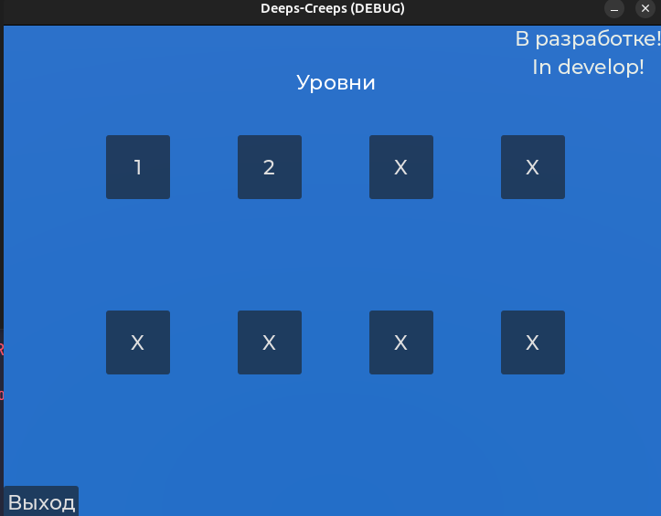
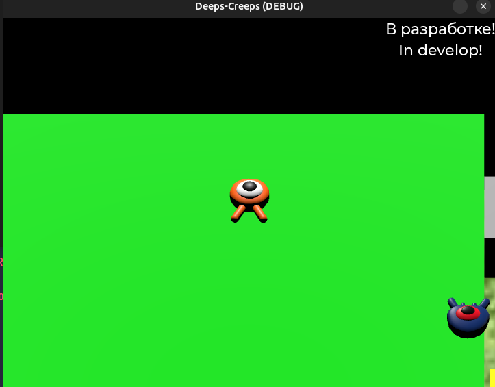
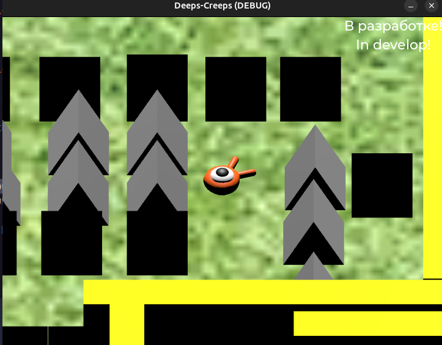

---
# О игре Deeps-Creeps
Deeps-Creeps - это маленькая игра платформер, где цель игрока это пройти все уровни в игре.
Она также является самой первой игрой автора, которую он делает.

Игра сделана на Godot 4 + Rust.

# <u>Предупреждение!</u>
Игру стоит запускать только после экспорта, 
иначе будет ошибка что файл конфига не может быть открыт. 

А также требуется перенести `config.json` в папку, где был экспортирован проект.
И надо создать директорию `logs/` и файл `logs/godot.log` для правильной загрузки.

Это временные недостатки!

# Сборка
> Предупреждение! Данный Makefile ещё не до конца готов, поэтому он может только запустить игру. Экспорт не проработан до конца!

Для того чтобы собрать игру вам требуется язык [Rust](https://www.rust-lang.org/ru/tools/install),
[GnuMake](https://www.gnu.org/software/make/) и [Godot 4.4](https://godotengine.org/). Выполните
следующую команду в зависимости от системы.

Для `Windows`: 
> make run-game-windows

Для `Linux`: 
> make run-game-linux

# Прогресс
Игра на данный момент находится на очень ранней стадии.
- [ ] Создание первых уровней.
    - [x] Создание 1 уровня и логики к нему.
    - [x] Расширение логики 1 уровня для более быстрого создания уровней.
    - [x] Создание 2 уровня/.
    - [ ] Объединение 1 и 2 уровня в 1 более большой. 
    - [ ] Check points на уровнях
- [ ] База для создания ***UI***.
    - [x] Основные меню:
        - [x] Главное меню.
        - [x] Меню выбора уровней.
        - [x] Меню настроек.
        - [x] Меню паузы во время игры.
    - [ ] Дополнительные ***UI***:
        - [ ] Отображение здоровья игрока.
        - [ ] Отображение баффов игрока (если понадобиться).
        - [ ] Меню диалогов (если понадобиться).
- [ ] Геймплей.
    - [x] Движение игрока.
    - [ ] Препятствия игрока.
        - [ ] Мобы.
            - [x] Простое движение по заранее заданному пути.
            - [ ] ИИ для преследования игрока.
        - [ ] Боссы
        - [x] Шипы.
    - [x] Выход из уровня.
    - [ ] Дополнительные секретные награды на уровне.
        * Неизвестно как они будут реализованны.
    - [ ] Разнообразие между уровнями:
        - [ ] 1 глава играется на земле.
        - [ ] 2 глава играется под водой.
        - [ ] 3 глава играется на земле.
- [ ] Графика.
    - [ ] Определенный визуальный стиль игры.
        * Думаю сделать его в мультяшном стиле.
    - [x] Визуальные эффекты.
        - [x] Эффект смерти игрока.
        - [x] Эффект смерти моба.
    - [ ] Геймплейные особенности:
        - [ ] Определенные стены становятся прозрачные при приближении игрока.
- [x] Конфиг.
    - [x] Сохранение настроек.
    - [x] Сохранение прогресса.
    - [x] Чтение/Запись конфига.

# Архитектура игры.
Узнать какая часть кода можно по сгенерированной rust документации (её нужно сгенерировать вручную) и по
файлу `architecture.drawio`, который открывается сервисом [draw.io](https://app.diagrams.net/).
